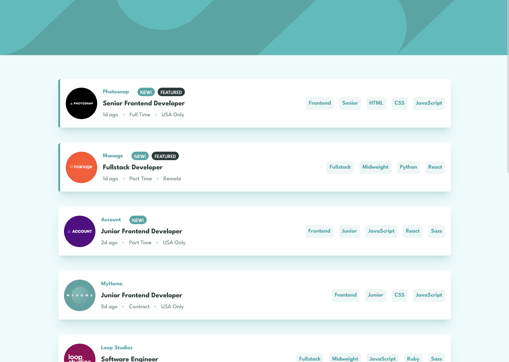
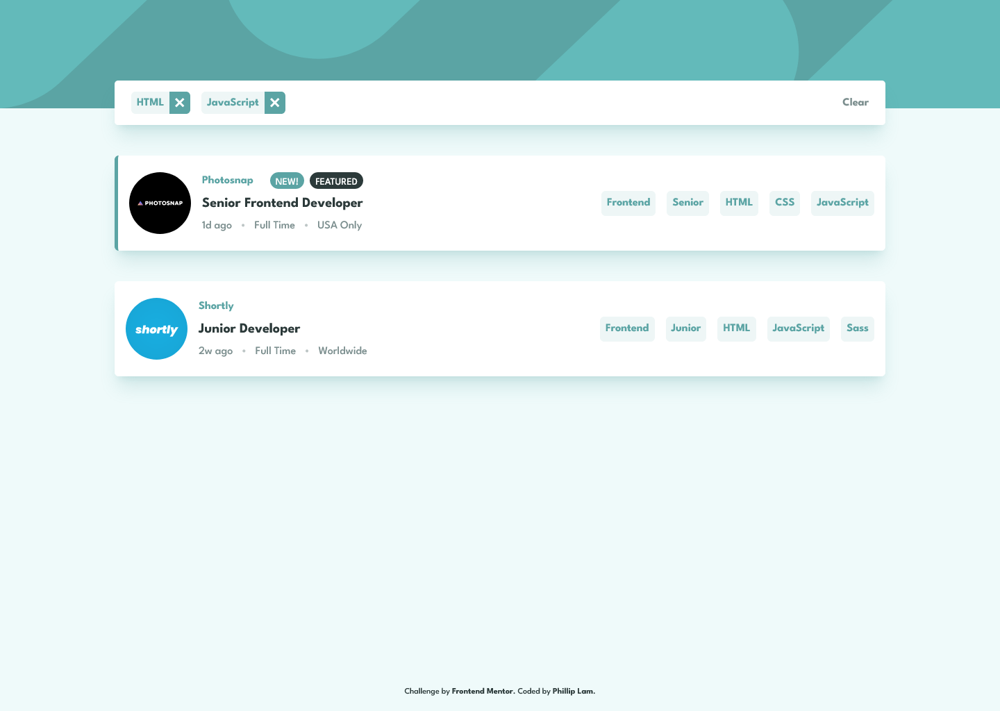
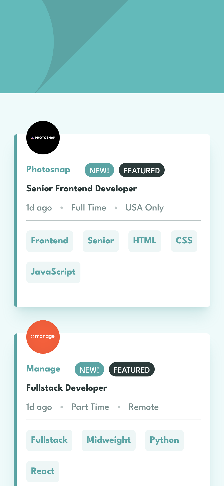
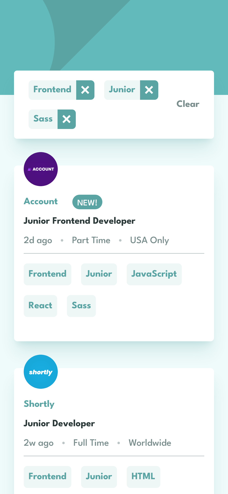

# Frontend Mentor - Job listings with filtering solution

This is a solution to the [Job listings with filtering challenge on Frontend Mentor](https://www.frontendmentor.io/challenges/job-listings-with-filtering-ivstIPCt). Frontend Mentor challenges help you improve your coding skills by building realistic projects.

- 👉 Live Site: [DEMO](https://static-job-listings-app-challenge.vercel.app/)
- [GitHub Repository](https://github.com/philliplam8/static-job-listings-app-challenge)

## Table of contents

- [Overview](#overview)
  - [The challenge](#the-challenge)
  - [Screenshot](#screenshot)
- [My process](#my-process)
  - [Built with](#built-with)
  - [Useful resources](#useful-resources)
- [Author](#author)

## Overview

### The challenge

Users should be able to:

- View the optimal layout for the site depending on their device's screen size
- See hover states for all interactive elements on the page
- Filter job listings based on the categories

### Screenshot

#### Desktop

#### Mobile

## My process

### Built with

- Semantic HTML5 markup
- CSS custom properties
- Flexbox
- CSS Grid
- Mobile-first workflow
- [React](https://reactjs.org/) - JS library
- [Next.js](https://nextjs.org/) - React framework
- [TailwindCSS](https://tailwindcss.com/) - For styles

### Useful resources

- [Loading Data from File in Next.js](https://vercel.com/guides/loading-static-file-nextjs-api-route) - This helped me by providing an example on how to use the Next.js pages/api functionality for fetching data with SWR (stale-while-revalidate)
- [Next.js TypeScript Types](https://nextjs.org/docs/api-routes/response-helpers)
- [Resizing Next.js Images](https://nextjs.org/docs/basic-features/image-optimization#local-images)

## Author

- Frontend Mentor - [@philliplam8](https://www.frontendmentor.io/profile/philliplam8)
